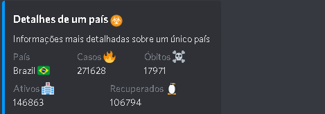

<h1 align="center">COVID-19 Discord bot</h1>
<p align="center">
  <strong>Notificação de casos de doença pelo coronavírus 2019 (COVID-19) no Brasil</strong>
</p>

## Instruções de uso

Página de divulção do projeto mostrando dados que são consumidos via api.

Comando !casos:

<div align="center">
  <br>
    
  <br>
</div>

Comando !casos {país}
<div align="center">
  <br>
    
  <br>
</div>

## Motivo 🤔

Criar um bot para prover informações sobre no discord com node.js

## Servidor de desenvolvimento 🚀

Clonando o projeto:

```
git clone https://github.com/luismarquezzini/corona-bot.git
```

Navegando até a pasta do projeto:

```
cd corona-bot/
```

Baixando as dependências do projeto

```bash
npm install
```

Rodando o projeto

```bash
npm start
```
## Agradecimentos

A essa api: https://github.com/devarthurribeiro/covid19-brazil-api
Pois foi a usada para alimentar o bot pela clareza e organização dos dados.
